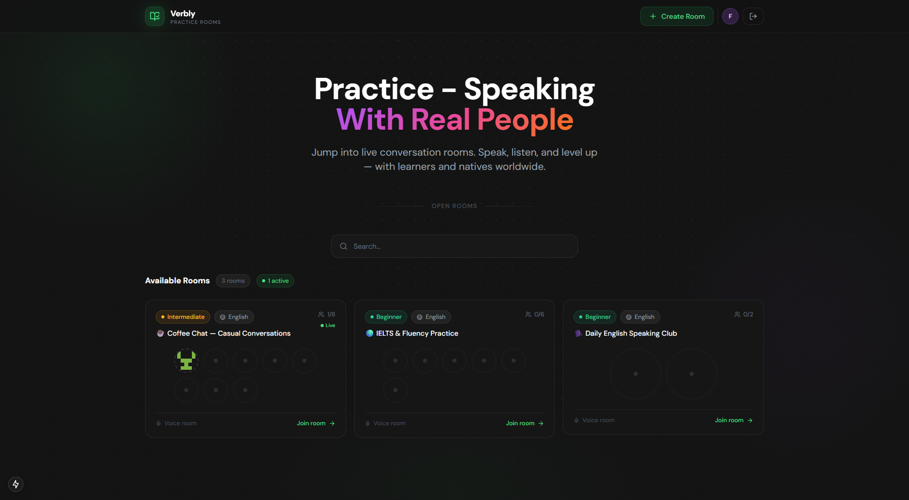
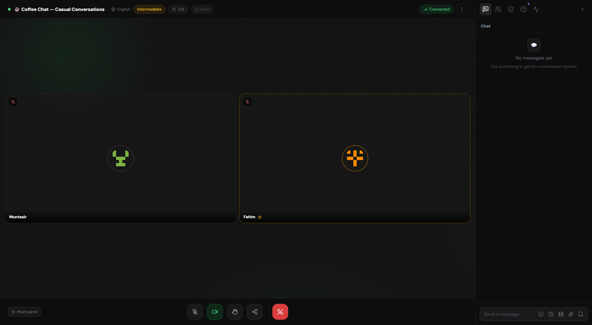
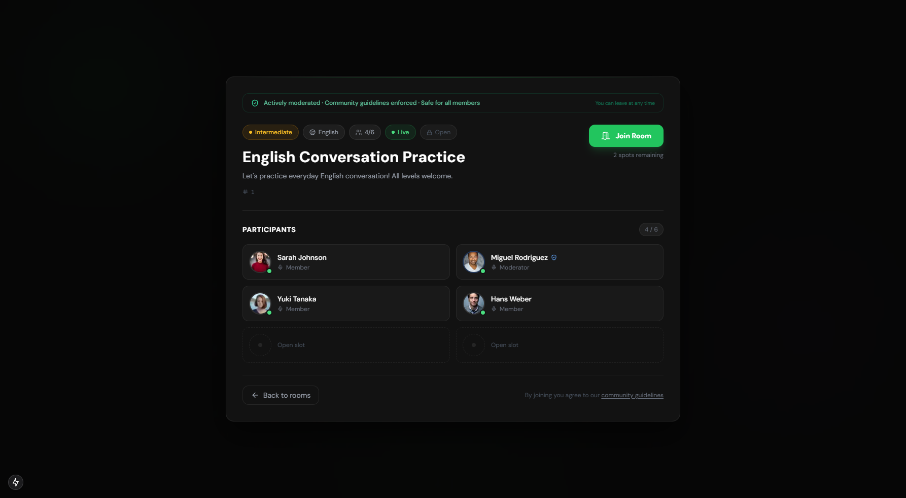

# Syncora24 — Frontend

Frontend application for **Syncora24**, a full-stack real-time language practice platform built with **Next.js**, **TypeScript**, **Redux Toolkit**, and **Tailwind CSS**.

**Live Demo:** https://syncora24-frontend.vercel.app

---

## Tech Stack

- **Framework:** Next.js (App Router)
- **Language:** TypeScript
- **State Management:** Redux Toolkit + RTK Query
- **Styling:** Tailwind CSS
- **Real-Time:** Socket.IO Client + WebRTC
- **Deployment:** Vercel

---

## Screenshots

| View | Screenshot |
|------|------------|
| Landing Page |  |
| Practice Room |  |
| Room details |  |

---

## Folder Structure

```text
frontend/
├── app/                    # Next.js App Router
├── components/             # Reusable UI components
├── context/                # React Context providers
├── hooks/                  # Custom React hooks
├── lib/                    # API clients and utilities
├── public/                 # Static assets
├── schemas/                # Validation schemas
├── store/                  # Redux store & RTK Query
├── types/                  # TypeScript types
├── utils/                  # Helper functions
├── .dockerignore
├── .env.example
├── Dockerfile
├── eslint.config.mjs
├── next.config.ts
├── package.json
├── postcss.config.mjs
├── README.md
├── tailwind.config.ts
└── tsconfig.json
```

---

## Environment Variables

Create a `.env` file in the `frontend` directory.

```env
NEXT_PUBLIC_API_URL=
```

---

## Getting Started

From the monorepo root:

```bash
pnpm --filter frontend dev
```

Or from the frontend directory:

```bash
pnpm install
pnpm dev
```

The application will be available at:

```text
http://localhost:3000
```

---

## Key Features

- JWT-based authentication
- Real-time voice communication with WebRTC
- Live chat using Socket.IO
- RTK Query for efficient data fetching and caching
- Global state management with Redux Toolkit
- Responsive UI built with Tailwind CSS
- Protected routes using Next.js Middleware
