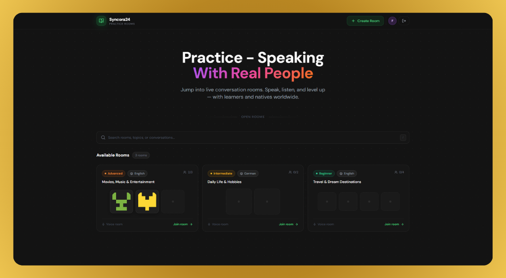
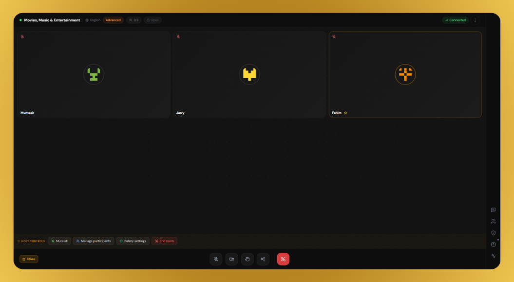
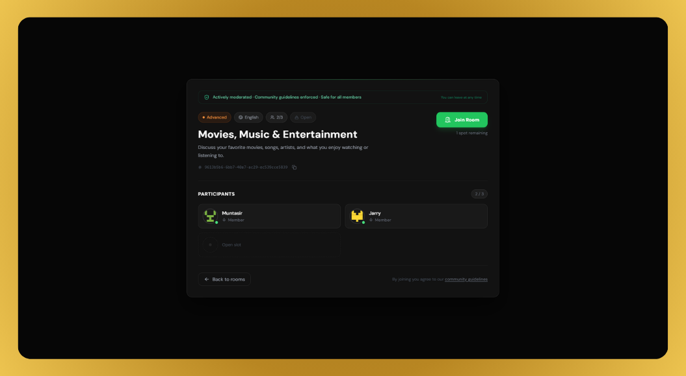
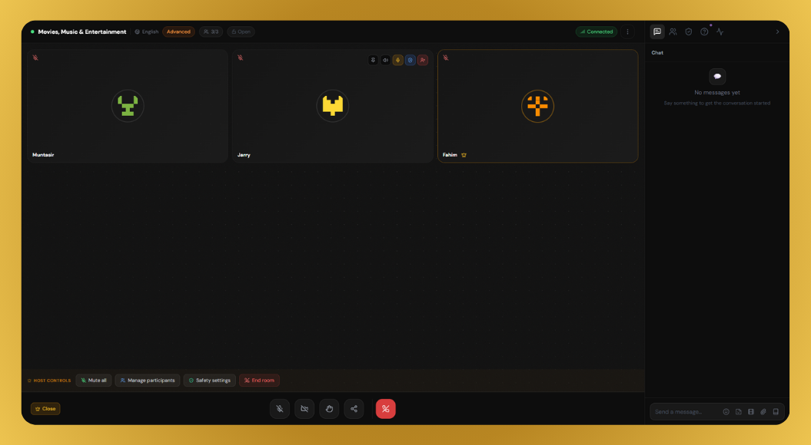
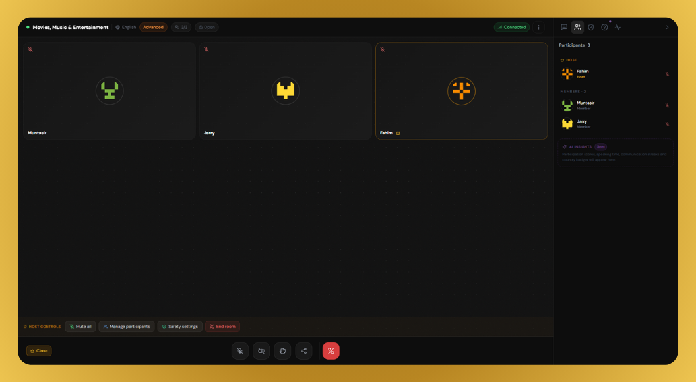

# Syncora24 — Frontend

Frontend application for **Syncora24**, a full-stack real-time language practice platform built with **Next.js**, **TypeScript**, **Redux Toolkit**, **RTK Query**, and **Tailwind CSS**.

The frontend provides the user interface for real-time rooms, messaging, audio/video communication, screen sharing, participant management, and room moderation.

**Live Demo:** https://syncora24-frontend.vercel.app

---

## Tech Stack

| Category | Technology |
|---|---|
| Framework | Next.js App Router |
| Language | TypeScript |
| State Management | Redux Toolkit + RTK Query |
| Styling | Tailwind CSS |
| Real-Time | Socket.IO Client |
| Media Communication | WebRTC |
| Authentication | JWT |
| Validation | Schema-based validation |
| Deployment | Vercel |

---

## Screenshots

| View | Screenshot |
|---|---|
| Landing Page |  |
| Practice Room |  |
| Room Details |  |
| Chat Panel |  |
| Room Participants |  |

---

## Folder Structure

```text
frontend/
├── app/                    # Next.js App Router
├── components/             # Reusable UI components
├── context/                # React Context providers
├── hooks/                  # Custom React hooks
├── lib/                    # API clients and shared utilities
├── public/                 # Static assets
├── schemas/                # Validation schemas
├── types/                  # TypeScript types
├── utils/                  # Helper utilities
├── .dockerignore
├── .env.example
├── Dockerfile
├── eslint.config.mjs
├── next.config.ts
├── package.json
├── postcss.config.mjs
├── README.md
├── tailwind.config.ts
└── tsconfig.json
```

---

## Environment Variables

Create a `.env` file in the `apps/frontend` directory.

```env
NEXT_PUBLIC_API_URL=
```

Set `NEXT_PUBLIC_API_URL` to the URL of the backend API you want the frontend to communicate with.

For local development, use the local backend URL.

---

## Getting Started

### From the Monorepo Root

```bash
pnpm --filter frontend dev
```

### From the Frontend Directory

```bash
cd apps/frontend
pnpm install
pnpm dev
```

The frontend will be available at:

```text
http://localhost:3000
```

---

## Key Features

### Authentication

The frontend provides the client-side authentication experience.

- JWT-based authentication
- Access token handling
- Refresh token handling
- Protected routes
- Authentication state management
- Authenticated room access

---

### Real-Time Audio Communication

WebRTC provides peer-to-peer audio communication between participants.

- Live voice conversations
- Microphone enable/disable controls
- Real-time microphone state synchronization
- Speaking indicators
- Participant audio state management
- Socket.IO signaling

---

### Real-Time Video Communication

The room also supports live video communication.

- Camera enable/disable controls
- Peer-to-peer video streams using WebRTC
- Real-time participant video state
- Video participant interface
- Audio and video communication within the same room

---

### Screen Sharing

Participants can share their screen during an active room session.

- Browser-based screen capture
- WebRTC screen stream
- Start/stop screen sharing
- Real-time screen-sharing state
- Screen sharing alongside audio/video communication

---

### Real-Time Room Chat

The room includes a real-time chat interface powered by Socket.IO.

- Instant text messages
- Room-specific messaging
- Real-time message synchronization
- Chat updates without page refreshes

---

### Live Room Activity

Room activity is displayed directly inside the chat section.

This provides participants with contextual visibility into important room events without requiring a separate activity page.

Activity can include:

- Members joining
- Members leaving
- Members being kicked
- Moderator promotion
- Participant mute/unmute events
- Mute-all enabled/disabled
- Room ending

Activity events are received through Socket.IO and rendered alongside regular room messages.

---

## Room Moderation

The frontend provides role-aware moderation controls.

### Members

Members can:

- Mute themselves
- Unmute themselves when allowed
- Control their own microphone
- Control their own camera
- Participate in room communication

### Hosts & Moderators

Hosts and moderators can:

- Mute individual participants
- Unmute participants when permitted
- Manage participant microphone controls
- Perform participant moderation actions
- Manage participants from the room interface
- Receive real-time moderation updates

### Global Mute All

Hosts can apply a global mute restriction to the room.

The frontend combines multiple pieces of room state to determine whether a participant can currently use their microphone.

For example, the effective microphone state can depend on:

- Local microphone state
- Individual forced-mute state
- Global mute-all state
- User role
- Current room permissions

This prevents the UI from incorrectly allowing a participant to unmute when a server-controlled moderation restriction is active.

---

## Participant Management

The room interface provides real-time participant information.

Participants can see:

- Active room members
- Participant roles
- Microphone status
- Camera status
- Speaking state
- Moderation-related state

Hosts and moderators receive additional participant controls based on their permissions.

---

## Room Lifecycle

The frontend handles room state changes in real time.

When a host ends a room:

1. The backend changes the room lifecycle state.
2. A real-time room-ended event is emitted.
3. Connected participants receive the event.
4. The frontend displays the room-ended state.
5. Room listings can update accordingly.

This prevents participants from being unexpectedly redirected while a room is being closed.

---

## State Management

Redux Toolkit is used for client-side application state.

RTK Query handles server communication and API data fetching.

The frontend state architecture is responsible for coordinating areas such as:

- Authentication
- Room state
- Participants
- Messages
- Room activity
- Moderation state
- Microphone state
- Video state
- WebRTC-related state
- Speaking indicators

Socket.IO events update relevant client state in real time.

---

## Real-Time Communication Flow

```text
                    Next.js Frontend
                           |
            +--------------+--------------+
            |                             |
        REST API                      Socket.IO
            |                             |
            v                             v
      Express Backend            Real-Time Events
                                          |
                              +-----------+-----------+
                              |                       |
                           Chat / Room            WebRTC
                           Events / State          Signaling
                                                      |
                                                      v
                                           Peer-to-Peer Connection
                                                      |
                                    +-----------------+----------------+
                                    |                 |                |
                                  Audio             Video          Screen Share
```

The frontend uses REST APIs for persistent application operations and Socket.IO for real-time events and WebRTC signaling.

WebRTC is responsible for peer-to-peer media communication.

---

## Browser Permissions

Audio, video, and screen sharing require browser permissions.

Users may be asked to grant access to:

- Microphone
- Camera
- Screen capture

The availability of these features depends on browser support, permission state, and secure browser contexts.

---

## Development Notes

Because Syncora24 uses WebRTC, local testing of real-time communication is easiest when using multiple browser tabs or separate browser instances.

For testing multiple participants:

1. Start the frontend and backend locally.
2. Open the application in multiple browser sessions.
3. Sign in with different accounts.
4. Join the same room.
5. Test audio/video communication, chat, moderation, and screen sharing.

---

## Related Documentation

- [Root Project Documentation](../../README.md)
- [Backend Documentation](../backend/README.md)

---

## Deployment

The frontend is deployed on **Vercel**.

Production application:

https://syncora24-frontend.vercel.app